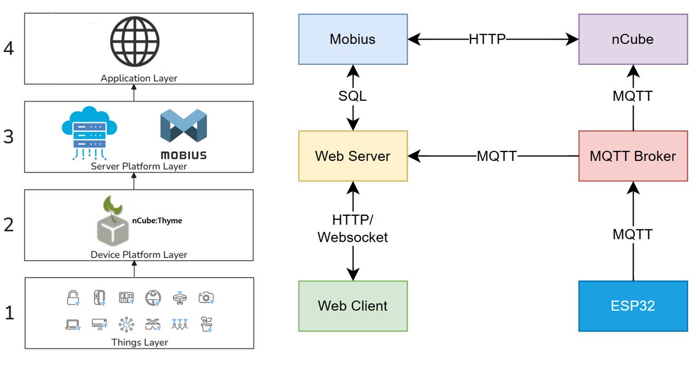
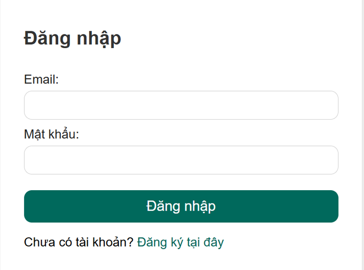
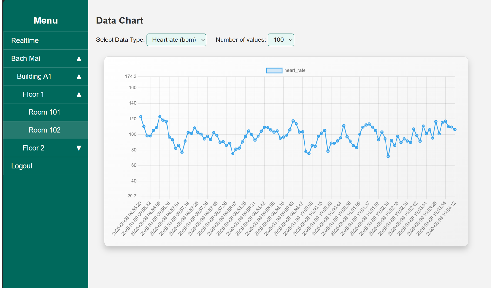
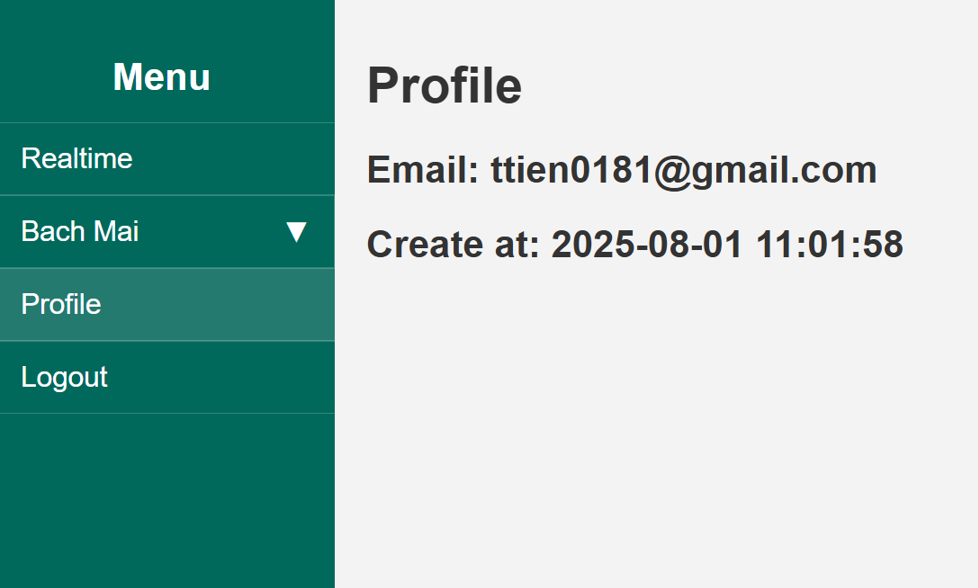
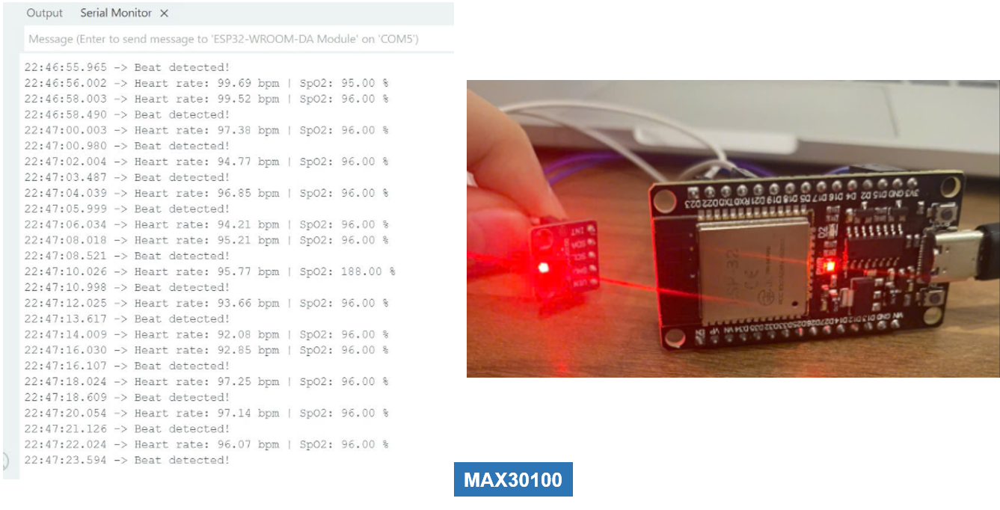
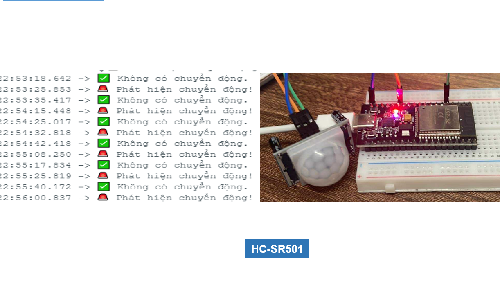
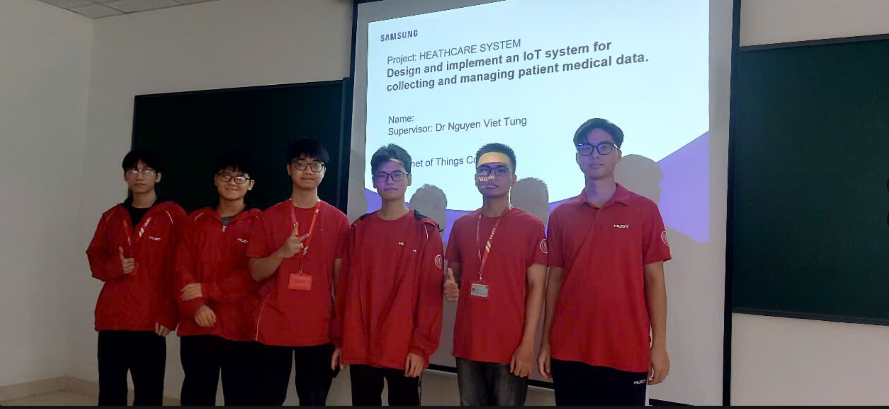

#  Health Monitoring System
A real-time IoT-based health monitoring system that collects vital signs such as heart rate, SpO₂, body temperature, and motion using biomedical sensors and ESP32, then processes and visualizes the data through a full-stack IoT architecture (MQTT, [Mobius](https://github.com/IoTKETI/Mobius) [oneM2M](https://github.com/IoTKETI/oneM2MBrowser), [nCube Thyme Nodejs](https://github.com/IoTKETI/nCube-Thyme-Nodejs), Flask Web Dashboard).

--- 
## Overview
This project was built as part of the **Samsung Innovation Campus - IoT Capstone Course**. The system aims to enhance hospital and remote patient monitoring by enabling continuous data acquisition, real-time alerting, and historical trend visualization.

--- 

## Requirements
### 1. Operating System
- Linux
- Window Subsystem for Linux (WSL)
### 2. Software & Tools
- Python: version 3.10 or higher, you can check your current version by running
```bash
python3 --version
```
- Git: clone reposistory 
```bash
git clone https://github.com/ttien0181/IOT_SS.git
```
- MariaDB: 
```bash 
sudo apt install mariadb-server
```

### 3. Hardware
#### Actuators
- **Led** 

- **Buzzer** 

#### Sensor
- **MAX30100** (HR, SpO₂) 

- **KY-039** (HR)
 
- **DHT11** (Temp)
 
- **HC-SR501** (Motion)


#### Microcontroller 
**ESP32** (sends sensor data via MQTT)


---
## System Architecture


---
## Sensor Thresholds & Alerts
| Sensor     | Normal     | Warning     | Critical    |
|------------| ---------- | ----------- | ----------- |
| Heart Rate | 60–100 bpm | <55 or >110 | <45 or >130 |
| SpO₂       | ≥ 95%      | 90% – 94%   | <90%        |
| Motion     | Detected   | —           | No Motion   |

---
## Demo Screenshots

















---
## How to Run
### 1. Hardware Setup

- Flash ESP32 with Arduino/PlatformIO code (esp32/)

- Connect sensors (MAX30100, KY-039, HC-SR501, etc.)

- Power ESP32 and Raspberry Pi

### 2. Run MQTT Broker
```bash
sudo systemctl start mosquitto
```

### 3. Run Mobius (IoT Platform)
```bash
cd Mobius
npm install
node mobius.js

```
### 4. Run nCube-Thyme (Edge App)

```bash 
cd nCube-Thyme-Nodejs
npm install
node thyme.js
```
### 5. Create Vitual Environment
```bash 
cd Flask-web
sudo apt update
sudo apt install python3.12-venv
python3 -m venv myvenv
```
### 6. Run Flask Web Dashboard
```bash
cd Flask-web
source myvenv/bin/activate
pip install -r requirements.txt
python3 run.py
```
---
## Future Improvements
- Add AI anomaly detection (arrhythmia, hypoxia)
- Develop mobile app for doctors/nurses
- Battery support for ESP32 + backup server
- Cloud data storage and remote monitoring

---
## Team members

- [Nguyễn Quang Dũng](https://github.com/Duzngpanda05)
- [Hoàng Anh Tú](https://github.com/ttien0181)
- [Vũ Trung Hiếu](https://github.com/hieuvu0212)
- [Nguyễn Quang Huy](https://github.com/huymtpzz1)
- [Nguyễn Quang Linh](https://github.com/JKunnarter)
- [Nguyễn Quốc Anh](https://github.com/QuanhVipPro)

